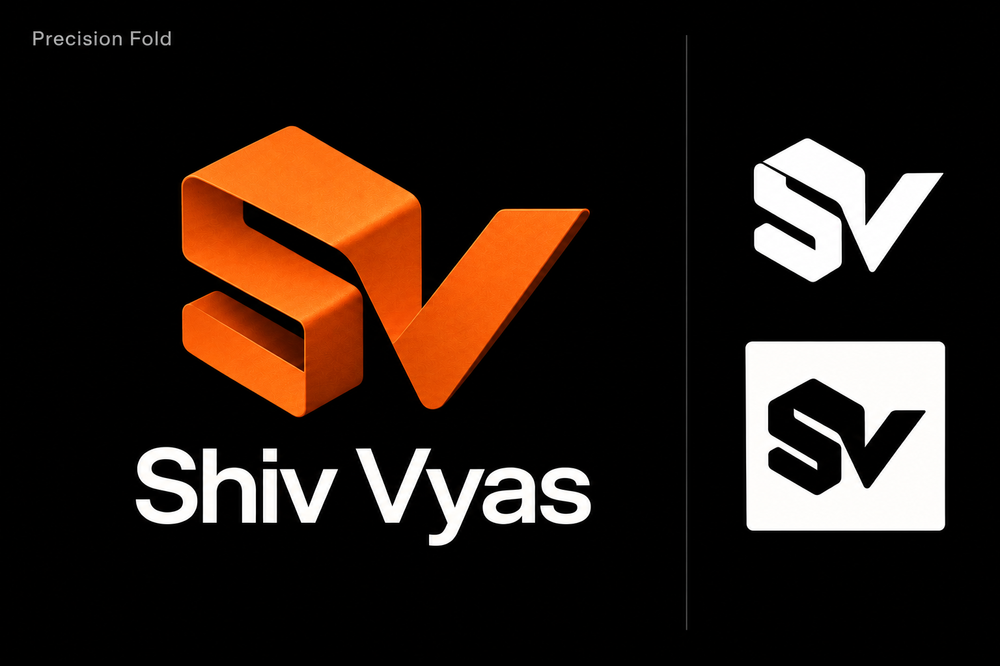
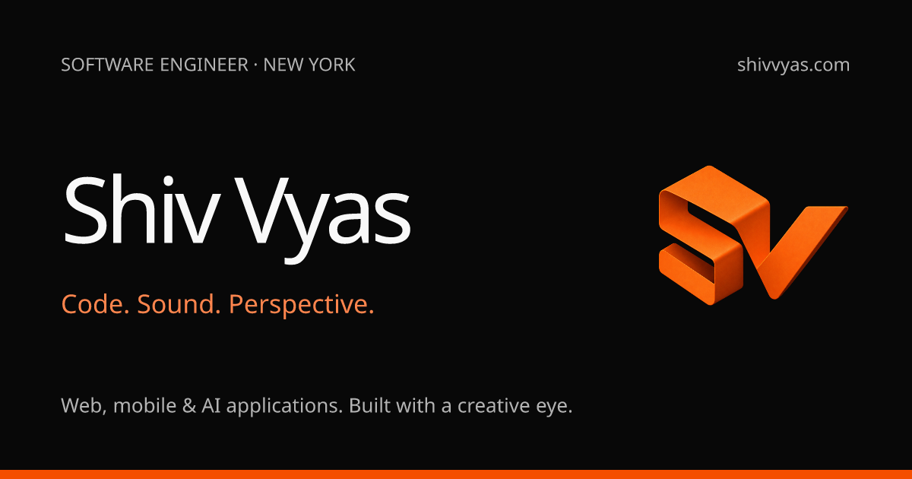
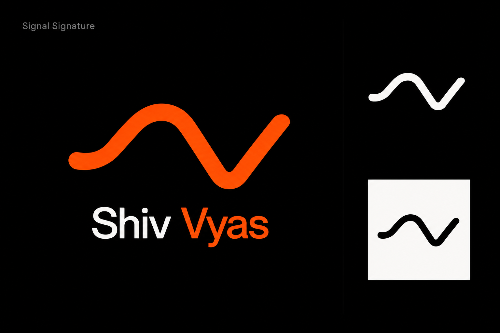
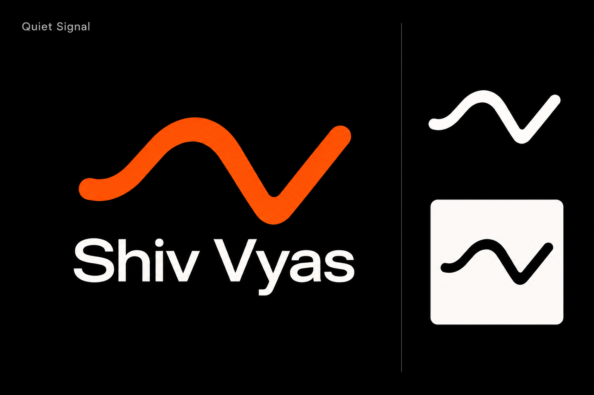

# Shiv Vyas branding

**Precision Fold** is the selected website identity. This folder also preserves the Isometric and Signal directions shortlisted during the logo exploration.

## Precision Fold

| File | Purpose |
| --- | --- |
| [Orange 3D mark](precision-fold/precision-fold-3d.png) | 512 × 512 PNG with transparency; header, footer, covers, and larger brand placements |
| [White monochrome mark](precision-fold/precision-fold-mono.png) | 128 × 128 PNG on black; small icons and static monochrome uses |
| [Orange master](precision-fold/masters/precision-fold-3d.png) | Original high-resolution production image |
| [Monochrome master](precision-fold/masters/precision-fold-mono.png) | Original high-resolution white-on-black production image |
| [Presentation](precision-fold/presentation.png) | Selected concept with dimensional and monochrome treatments |

The monochrome PNG has a black background; use its luminance as a mask when it needs to sit over another background. The orange production PNG has transparency. Keep the aspect ratio and clear space around either version.

### Header treatment

The navbar uses the orange 3D mark with brighter highlights and a soft orange bloom. A 3.8-second pulse gently increases the mark's size by up to 5.5% while the glow brightens. Users who prefer reduced motion see the static illuminated version. This is an HDR-style visual effect made with CSS; the original PNG is a standard image, not HDR-encoded media.

## Browser and mobile icons

| File | Size / use |
| --- | --- |
| [favicon.ico](icons/favicon.ico) | Includes 16, 32, and 48px frames |
| [favicon-96x96.png](icons/favicon-96x96.png) | 96px browser favicon |
| [apple-touch-icon.png](icons/apple-touch-icon.png) | 180px home-screen icon |
| [icon-16.png](icons/icon-16.png), [icon-32.png](icons/icon-32.png), [icon-48.png](icons/icon-48.png) | Individual small PNG exports |
| [icon-192.png](icons/icon-192.png), [icon-512.png](icons/icon-512.png) | Browser manifest icons |

## Sharing preview

[Download the 1200 × 630 social card](social/shiv-vyas-social.png).

## Other selected directions

These are saved concept presentations, not alternate live website identities. Each board includes its own logo treatments; they are not separate transparent or vector exports.

### Isometric Fold

The original dimensional SV direction that led to Precision Fold.

### Signal Signature

The original signal-inspired direction.

### Quiet Signal

The refined flowing signal mark.

### Folded Signal

The combined signal contour and orange folded-ribbon direction.

## File notes

- Assets are PNG and ICO, not SVG/vector originals.
- The images were generated with OpenAI ImageGen; production icon and social exports use the project's existing `next/og` tooling.
- This is the repository's portable branding archive. Runtime copies remain in `public/` for the website.
- [manifest.json](manifest.json) lists every asset's size in bytes and SHA-256 checksum. All copies were verified against the selected originals.
