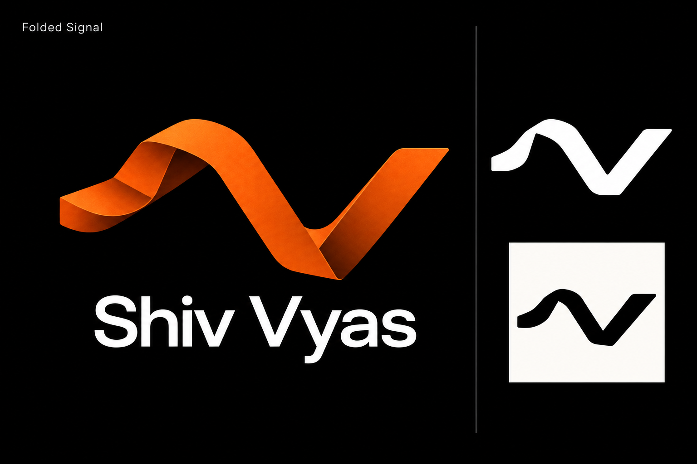

# Isometric and signal refinements

This round develops Shiv's two selected directions from the ten-logo exploration: **Isometric Fold** and **Signal Signature**. The existing website design remains the visual reference; no website code or branding has been changed in this round.

The three final directions are identified by their titles, since two initial renders were corrected to remove excessive glow.

| Direction | Emphasis | Best use |
| --- | --- | --- |
| Precision Fold | A compact, geometric SV with restrained isometric depth. | A recognizable personal monogram that relates to the site's 3D workstation. |
| Quiet Signal | One simple flowing stroke with a crest and a V valley. | A small navigation mark, photography watermark or music signature. |
| Folded Signal | The signal contour expressed as one folded orange ribbon. | A shared identity that combines the two selected ideas, with a sculptural treatment for larger uses. |

The combined direction is the most direct way to bring both preferences together. Quiet Signal remains the simplest small-scale direction; Precision Fold makes the initials more explicit. A final choice should use one consistent silhouette across a flat master and any 3D treatment.

These are raster concept presentations. The monochrome examples are design references, not completed vector exports or a substitute for testing the final mark at favicon sizes.

Generated with the built-in ImageGen tool. All source prompts, including cleanup passes, are saved in [prompts.json](prompts.json).

## Precision Fold

## Quiet Signal

## Folded Signal

