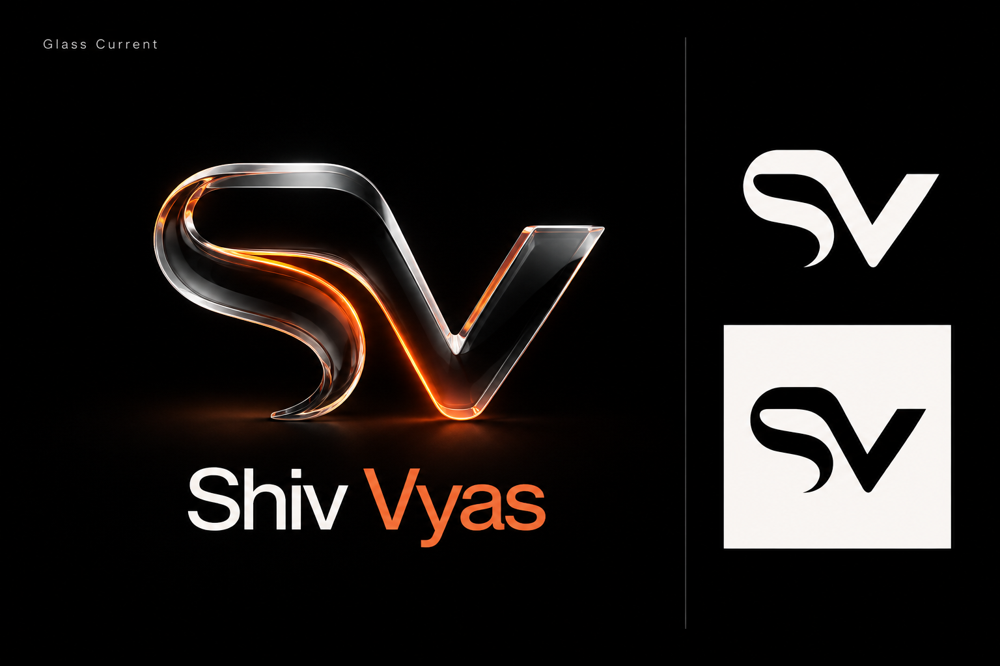
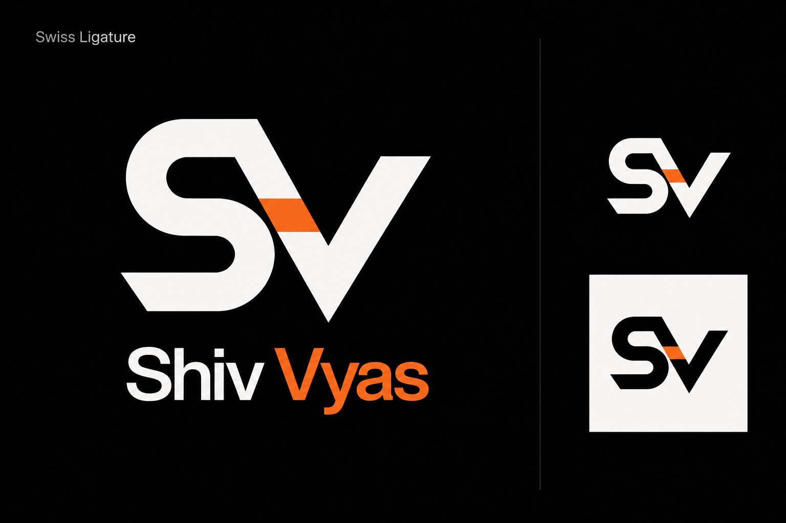
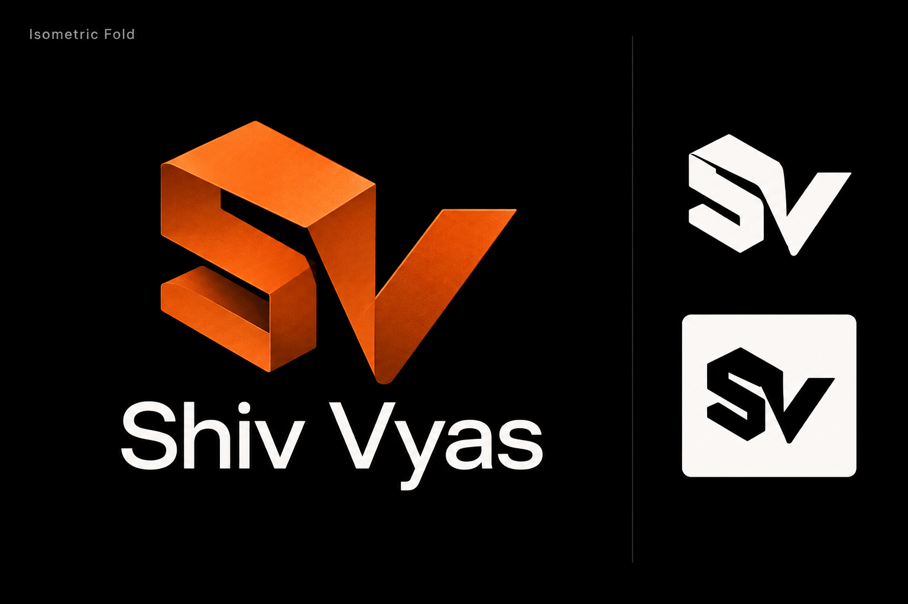
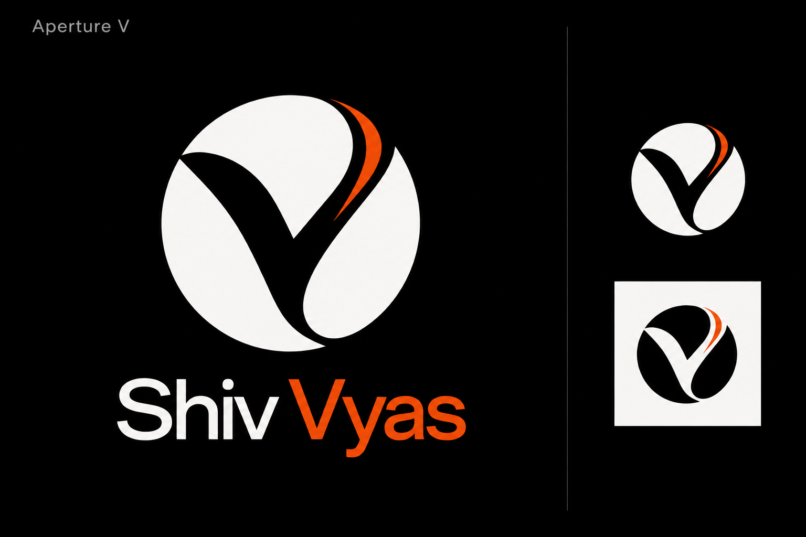
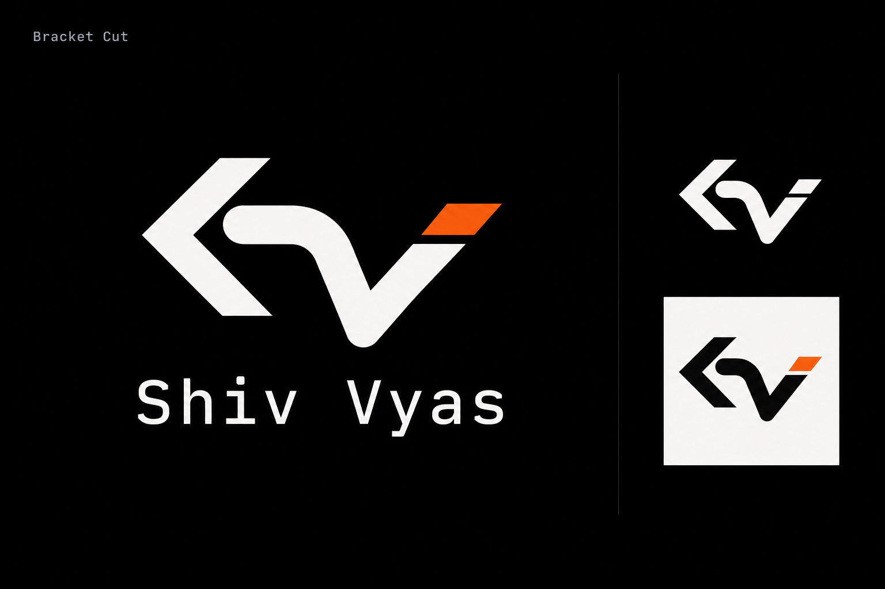
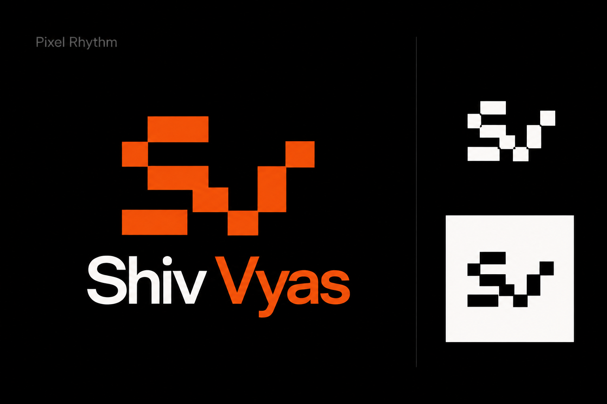
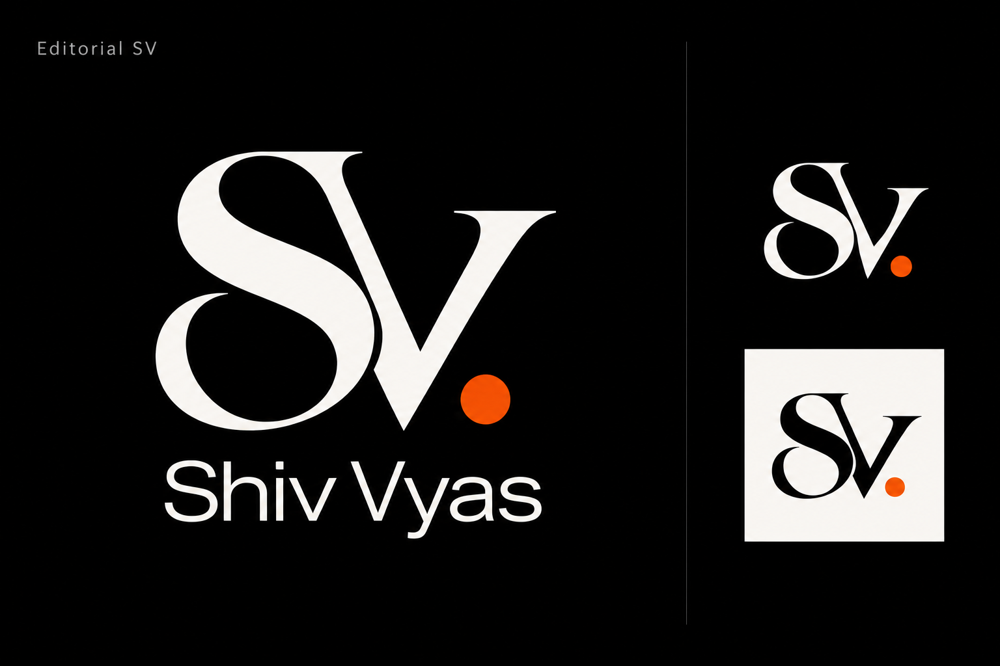
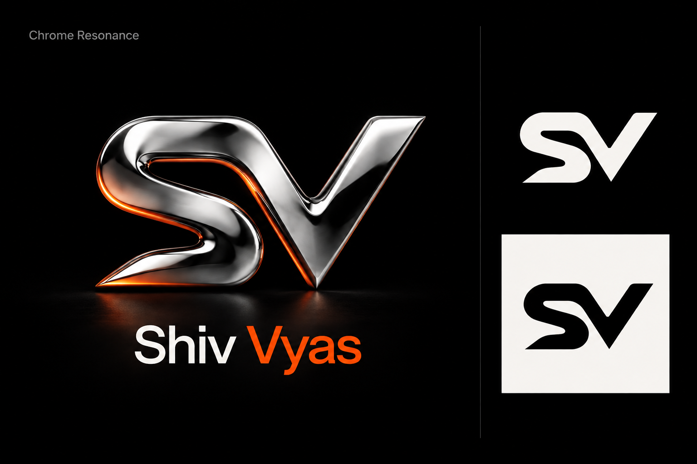
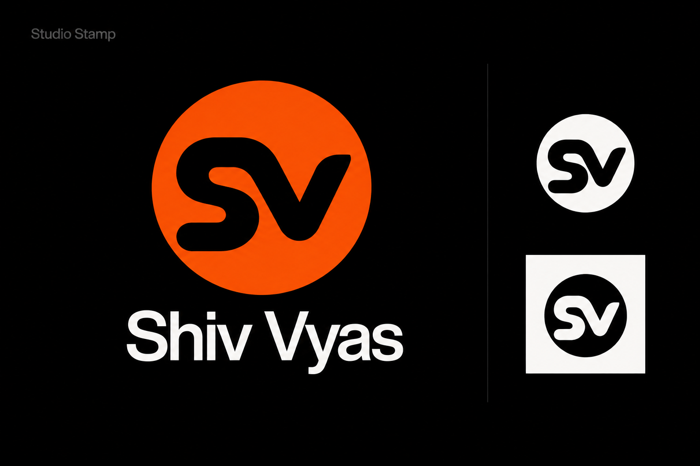

# Ten logo directions for Shiv Vyas

These concepts share your website’s black, warm-white and ember-orange palette, while exploring different identities for engineering, music and photography. Numbers match the order the ten generated images appeared in the conversation.

My shortlist is **1, 2 and 10**. Choose **1** if the liquid-glass character matters most, **2** for the most versatile everyday identity, or **10** for a compact personal stamp. A selected mark can have one flat master and a matching 3D treatment for larger artwork.

| Option | Direction | What it expresses | Website and standalone use | Refinement needed |
| --- | --- | --- | --- | --- |
| 1 | Glass Current | Fluid SV with optical glass and warm edge light; creative technology and sound. | Closest to your original liquid-glass brief; striking on the dark site, social covers and music artwork. Its flat counterpart can serve navigation. | Strengthen the thin S terminal and unify the glass and flat outlines. |
| 2 | Swiss Ligature | Bold geometric initials, shared diagonal, small orange accent. | My strongest overall recommendation: crisp beside the existing typography, legible on a résumé, avatar or sticker. | Remove the accent in a true one-color export and fine-tune the shared stroke at favicon sizes. |
| 3 | Isometric Fold | Angular orange planes suggest building and spatial composition. | Best match for the existing 3D workstation; memorable as a hero emblem or project signature. | Simplify the internal fold gap for tiny icons and standardize the perspective. |
| 4 | Signal Signature | A single flowing wave ending in a V valley. | Music-led and personal; suitable as a small photo watermark or subtle animated audio identity. | The S is abstract and the symbol currently resembles a generic waveform; refine its gesture to make it more distinctive. |
| 5 | Aperture V | Circular optical emblem with a V in negative space. | Photography-led; the compact shape works independently as an avatar and pairs well with the site’s minimal layout. | Widen the narrow orange cut and test a genuinely single-color version. |
| 6 | Bracket Cut | Code-inspired angles, curved connection and a terminal accent. | Most directly signals development; useful on GitHub-related graphics and technical project covers. | The S is not yet readable enough; the bracket and V need tighter integration. |
| 7 | Pixel Rhythm | Modular stepped initials evoke software, pixels and sequencing. | Playful digital personality that still fits the orange palette; useful for small badges and creative-coding work. | Redraw on one consistent grid; the generated small examples vary slightly. |
| 8 | Editorial SV | A refined serif monogram adds a gallery and record-label tone. | Strong standalone photography signature and an elegant contrast with the site’s sans-serif typography. | Thicken hairline strokes for small sizes; keep the orange dot optional. |
| 9 | Chrome Resonance | Polished sculptural metal, strong reflections and angular terminals. | Best for expressive music artwork and large social visuals; visually compatible with your 3D scene. | Use the flat outline for navigation; simplify the lower S point and reflections for a calmer result. |
| 10 | Studio Stamp | Rounded initials cut out of a simple disc. | Best compact avatar and watermark direction; clear on light and dark backgrounds and easy to place beside your name. | Refine spacing between the S and V, and check that neither reads as a numeral at tiny sizes. |

These are image-generated design concepts, not finished SVG logos. The small treatments illustrate possible adaptations; some retain the orange accent or vary slightly from the large mark. A selected direction should be redrawn into one consistent vector master and checked at 16, 24 and 32 pixels before use. The website has not been changed by this exploration.

Generated with the built-in ImageGen tool using the current website screenshot as a visual reference. The complete prompt set is in [prompts.json](prompts.json); source-to-output mapping is in [manifest.json](manifest.json). Each PNG below is preserved as generated.

## 1. Glass Current

## 2. Swiss Ligature

## 3. Isometric Fold

## 4. Signal Signature

## 5. Aperture V

## 6. Bracket Cut

## 7. Pixel Rhythm

## 8. Editorial SV

## 9. Chrome Resonance

## 10. Studio Stamp

