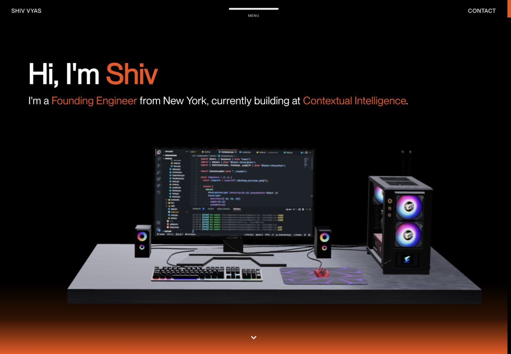
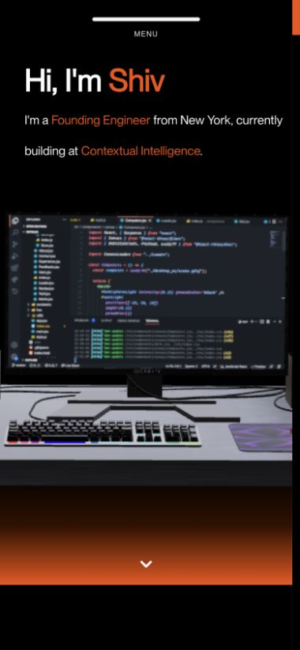
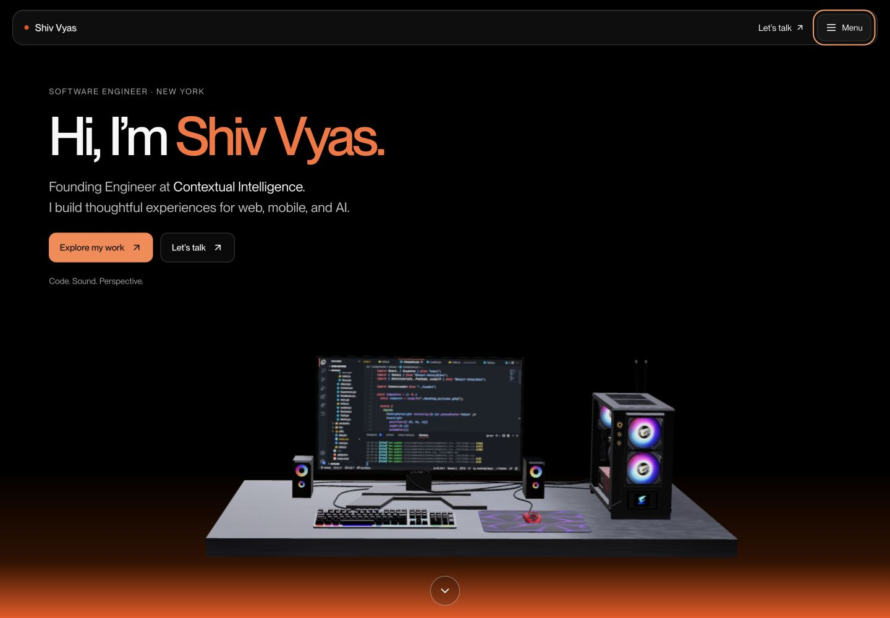
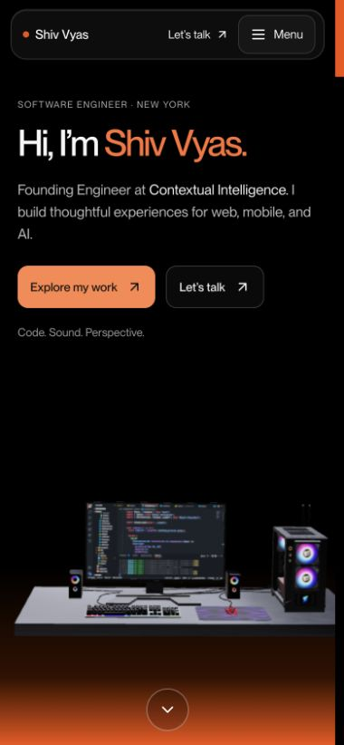
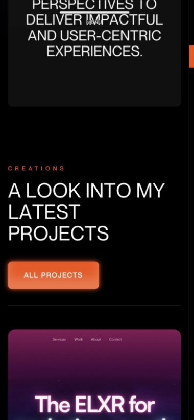
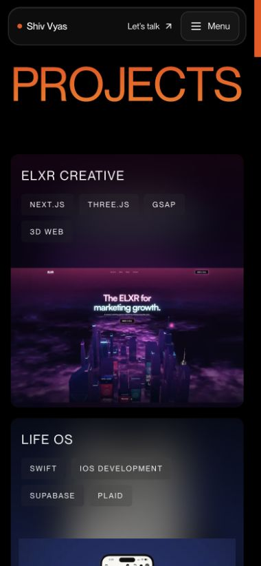
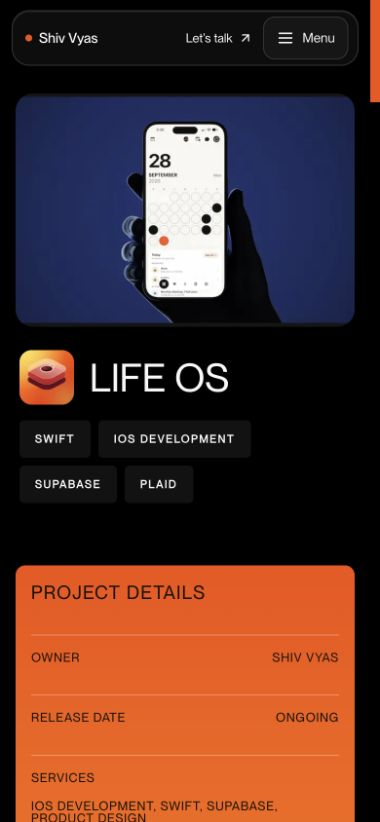
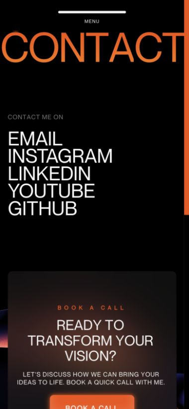
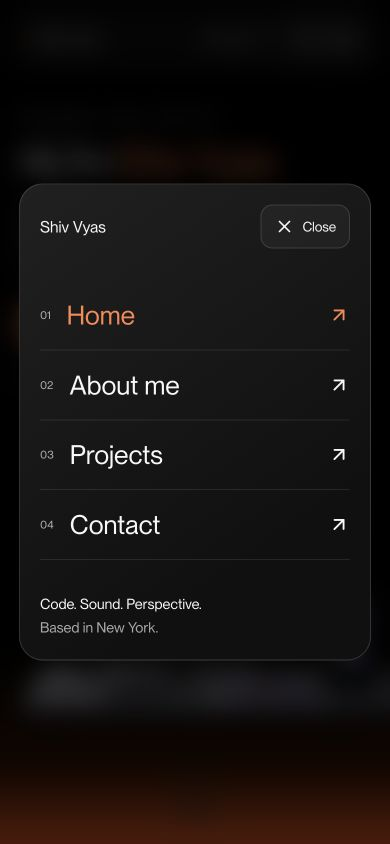
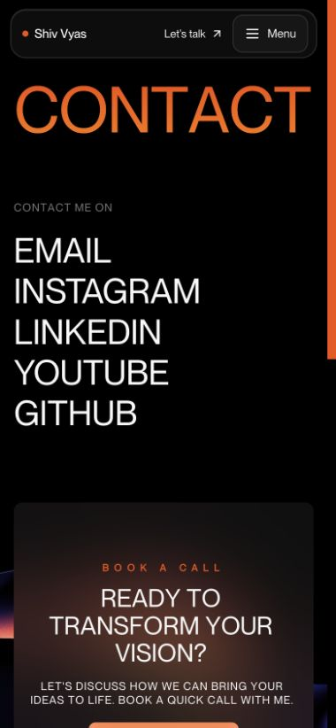

# Shiv Vyas: website review and improvements

**Design direction update:** Shiv requested the original header, hero, navigation and About presentation back. Those sections have now been restored, including the pre-existing mobile refinements, while SEO and accessibility improvements remain. The redesigned versions pictured in the initial review below are superseded. See [the current restoration notes and screenshots](restored-design/README.md).

Reviewed September 30, 2026. The live site was reviewed alongside the local Next.js project. This report preserves the initial review; the final changes have since been pushed to `main` and deployed. See [the archive index](../README.md) for the final direction, including all 14 homepage projects and restored heritage gallery.

The existing black-and-orange palette, oversized typography, project imagery, and 3D desk give the site a recognizable style. Its biggest weaknesses were the delayed entrance, limited actions on the first screen, mobile cropping, and inconsistent search identity. More decoration would have less impact than fixing these basics.

## 1. Arrive and understand who Shiv is

The desktop opening had a clear role and location, but only “Shiv” in the headline and no direct project action. On mobile, the header hid the name and contact link, while the workstation dominated the screen. The source also imposed a six-second counter before its exit animation.

**Implemented:** full-name headline, a concise description, direct project and contact links, a glass header with visible identity, a comfortably sized menu button, and immediate content without the artificial loader. The 3D scene is loaded separately and uses lower rendering resolution on phones. The reduced-motion setting omits that decorative scene.

## 2. Read the introduction and discover work

The original introduction was a long uppercase paragraph with a letter-by-letter scroll reveal. The next section repeated all 14 projects. The mobile capture shows the large spacing before the project section. Browser accessibility output also exposed many headings as separate letters.

**Implemented:** a shorter introduction that connects engineering, music, and photography; six recent projects on the homepage; a link to the complete 14-project archive; normal card flow on phones; complete accessible text for animated headings; and scoped desktop animations that clean up when screen size changes. Existing local fixes for visible touch labels and full project covers were retained.

Project detail covers now use their own image area on phones, with the title underneath, instead of cropping a landscape cover into a viewport-height portrait.

## 3. Navigate and get in touch

The original menu trigger was a clickable div rather than a keyboard button. The live footer displayed Shiv’s email but linked to a different address; the existing local correction was preserved. Contact links were closely packed, and the mobile headline reached the screen edge.

**Implemented:** a native modal navigation dialog, Escape dismissal and focus restoration, current-page indication, visible keyboard focus, a skip link, larger touch targets, and contact links that remain visible without animation. The updated mobile menu keeps the background inert while open.

## Search identity

The previous home title was “Shiv | Home”; shared-page metadata pointed to an old Vercel domain. There was no canonical link or robots.txt, and the sitemap used the noncanonical host and invented a new last-modified date on each generation.

Implemented across all 18 public pages:

- Descriptive titles containing “Shiv Vyas,” unique descriptions, and canonical URLs on `https://www.shivvyas.com`.
- Person and WebSite structured data with `shivvyas` as an alternate name and established public profile links. About uses ProfilePage; project pages use CreativeWork.
- Open Graph and Twitter metadata, a new 1200 × 630 social card, and project-specific sharing images.
- A robots.txt sitemap reference, 18 canonical sitemap entries, and sitemap generation before the production build. The old API sitemap address redirects to the same sitemap.
- One primary heading per public page, readable server-rendered content, font swapping, and responsive image optimization for project cards and detail imagery.

The active Next.js configuration already redirects the bare domain to `www`; the conflicting, unused static-export configuration was removed.

## After deployment

1. Verify the domain in Google Search Console. Submit `https://www.shivvyas.com/sitemap.xml`, inspect the home and about URLs, and request indexing. Check the canonical Google selects.
2. Link to the canonical website from the GitHub profile, LinkedIn website field, YouTube, and other public profiles. Use “Shiv Vyas” consistently.
3. Monitor the queries “Shiv Vyas” and “shivvyas” in Search Console. Indexing and ranking depend on Google and competing results; these changes do not guarantee first position.

These steps follow [Google’s Search Essentials](https://developers.google.com/search/docs/essentials), [site-name guidance](https://developers.google.com/search/docs/appearance/site-names), and [sitemap guidance](https://developers.google.com/search/docs/crawling-indexing/sitemaps/build-sitemap).

## Highest-value next design improvements

- Add a small, curated music and photography section with real work. A couple of tracks and three strong photographs will communicate your creative identity better than more animation.
- Give each featured project one verifiable outcome near its title: what you built, your role, and the result. Use actual numbers only when you can substantiate them.
- The About timeline now names Contextual Intelligence as the current role and marks FuteurAI “Ended May 12,” using your correction. The end year and current-role start date are not inferred.
- Develop the proposed SV ribbon into a vector master. Use the flat silhouette at favicon size and the liquid-glass treatment at larger sizes. Keep glass effects on navigation and branding where they preserve text contrast.
- Consider a compressed still fallback or an explicitly requested 3D experience on slow mobile connections. The existing model still has substantial asset weight; this pass improves loading structure and GPU resolution but does not eliminate that cost.

## Verification and limits

Production build and TypeScript checks pass. All 18 prerendered pages were checked for full-name titles, a unique description, one canonical URL, one main heading, valid JSON-LD, and absence of the staging address. All 18 page responses and four SEO assets returned 200; the legacy sitemap and canonical-host redirects returned 308; an unknown project returned 404.

Browser checks covered 320 px and 390 px phones and a 1440 px desktop home, plus mobile project discovery, a Life OS detail page, contact navigation, menu opening, and Escape focus restoration. The tested pages had no horizontal document overflow. No browser warnings or errors were captured in the local home check.

This is not a complete WCAG audit or a measured Lighthouse/Core Web Vitals report. Reduced-motion behavior is implemented in code but has not been verified by changing the operating system’s setting. Real-device Safari, slow-network behavior, and Google indexing still need verification. Production deployment was subsequently confirmed.
