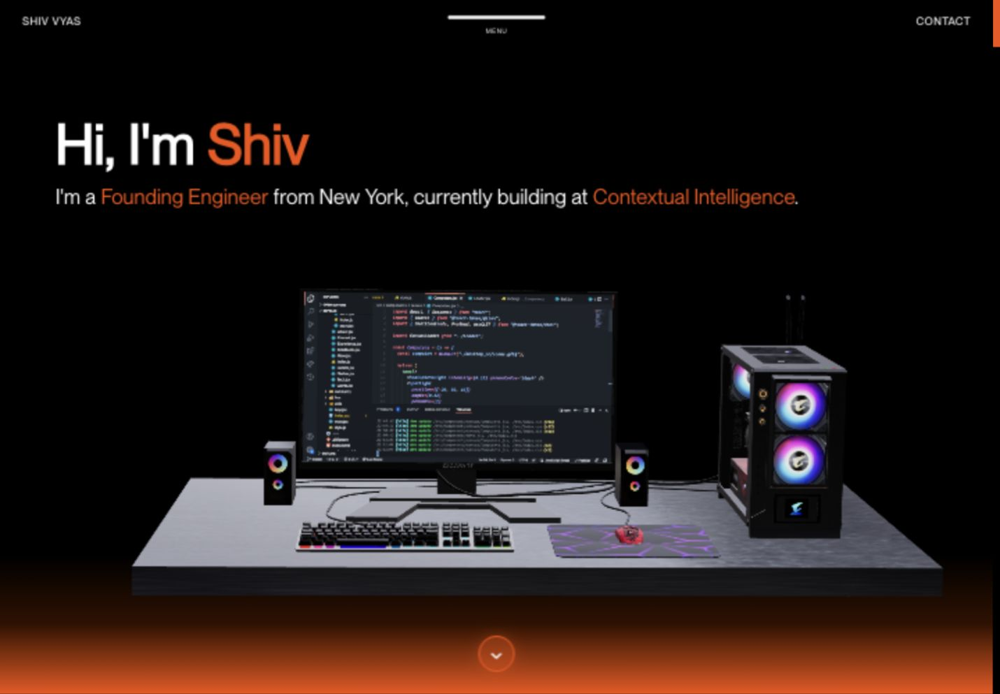
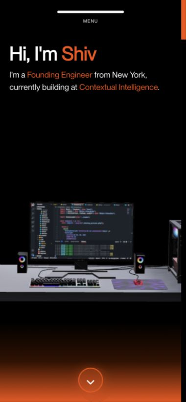
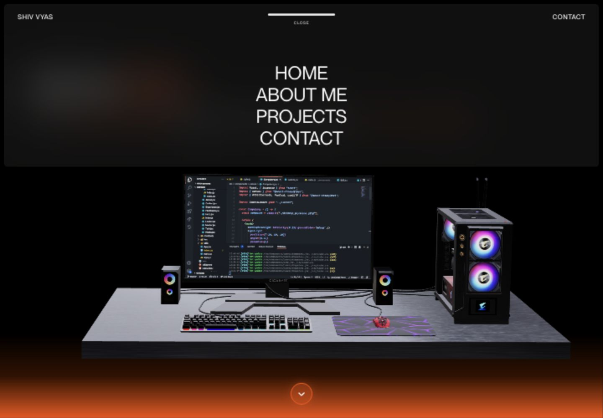
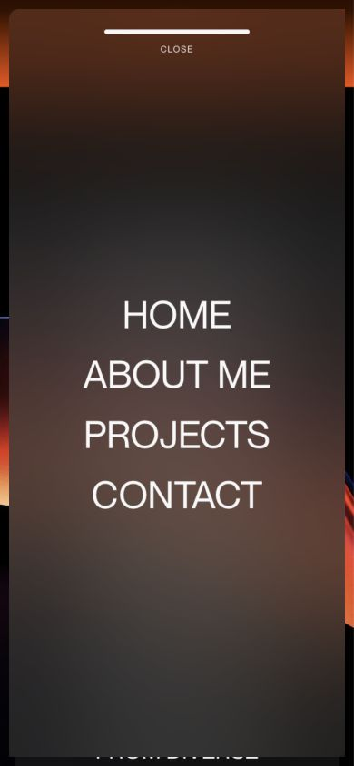
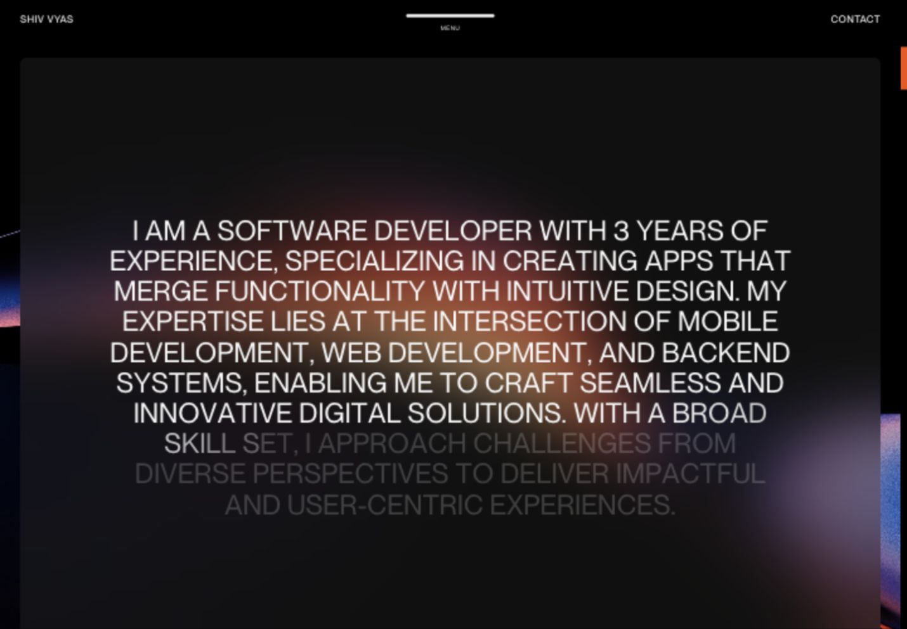
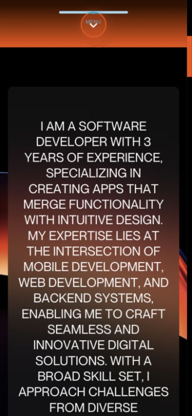
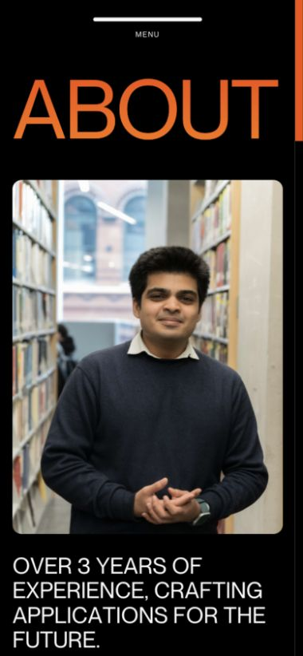

# Original design restored

Archive note: these screenshots precede the selected logo rollout. The restored design and subsequent branding have since been pushed to `main` and deployed. See [the archive index](../../README.md) for the final direction.

The original pre-edit component snapshots were recovered from this task's earlier file reads, preserving the mobile work that existed before the redesign.

- Restored the minimal header with the centered line and MENU label, left name and right Contact link on desktop.
- Restored the wide blurred menu panel and centered uppercase navigation links. Kept a native dialog, keyboard activation, Escape dismissal, focus restoration and scroll locking.
- Restored the original “Hi, I'm Shiv” hero, role description, type scale, gradient and workstation composition. Removed the added eyebrow, two calls to action and interests line.
- Restored the large centered uppercase About paragraph, overlay background and desktop scroll reveal. Kept complete accessible text and made the paragraph fully readable on phones without a scroll-dependent reveal.
- Restored the original About-page invitation. Kept the corrected employment history and existing page layout.
- Retained the SEO work, immediate content loading, reduced-motion support and lower mobile canvas rendering resolution.

Small-screen refinements remain limited to existing stable viewport sizing, text wrapping, spacing, the original mobile scene adjustments, a 44 px menu target and slightly smaller About text. No new visual identity or logo has been applied.

Validation: production build and TypeScript passed; reviewed the desktop at 1440 px and phones at 390 px and 320 px. The tested page widths did not overflow horizontally. Verified menu opening, Escape and focus return, About-page navigation and the desktop About reveal. No errors appeared in the captured browser log.

## Desktop home

## Mobile home

## Desktop menu

## Mobile menu

## Desktop About

## Mobile About

## About page on mobile

